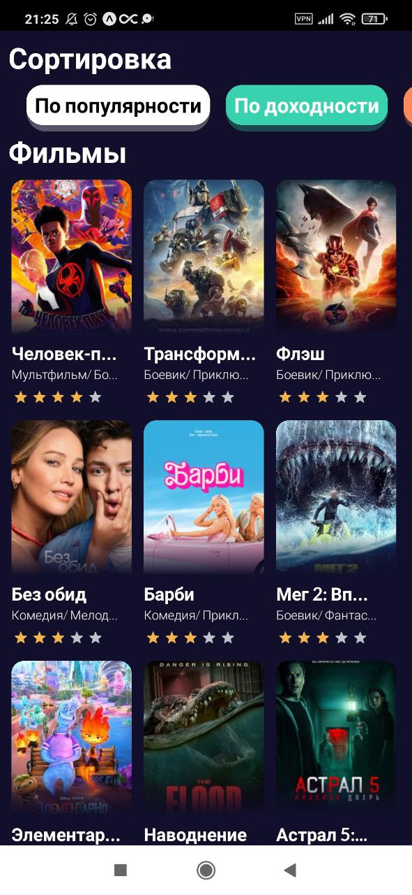
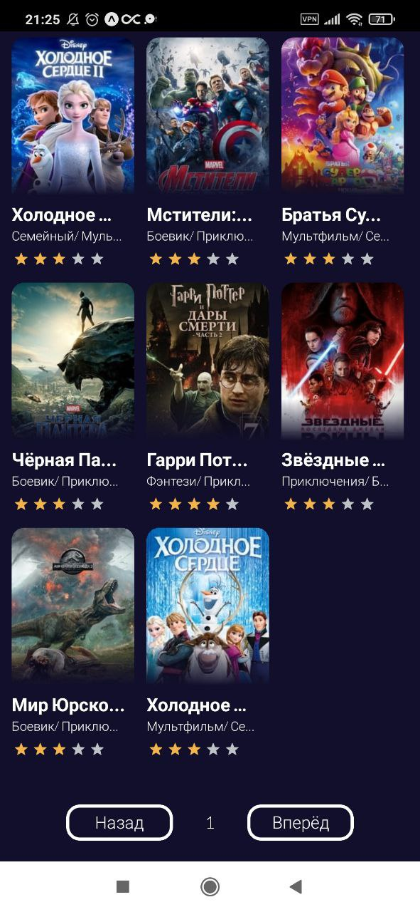

# Приложение для просмотра списка фильмов

Данное мобильное приложение выводит фильмы из базы данных (theMovieDB), и позволяет просматривать информацию о конкретном фильме.

## Требования

-   Node.js
-   expo-cli
-   Expo Go
-   API ключ theMovieDB (Его можно получить, зарегестрировавшись как разработчик на сайте theMovieDB)
-   VPN на смартфоне (В России theMovieDB не доступен)

## Инструкция для запуска

1. Нужно склонировать данный репозиторий:

```
git clone https://github.com/kildanL/Movies-List.git
```

2. После чего перейти в папку проекта:

```
cd Movies-List
```

3. Устанавливаем все зависимости:

```
npm install
```

4. Ввести полученный API ключ в переменную `javascript const TOKEN = '';` который находится:

```
├─ src
  ├─ service
    ├─ api.ts
```

5. Запуск приложения:

```
npm start
```

6. Сканируем полученный QR-код из терминала и запускаем Movie-List в приложении Expo Go

7. Включаем VPN если нужно

8. Всё готово!

## Функционал приложения:

-   Вывод списка фильмов по категориям (постранично)
-   Сортировка фильмов (по популярности, новинки, высокий рейтинг, по доходности)
-   Просмотр информации о конкретном фильме

<!--  -->
<p align=center>





</p>
